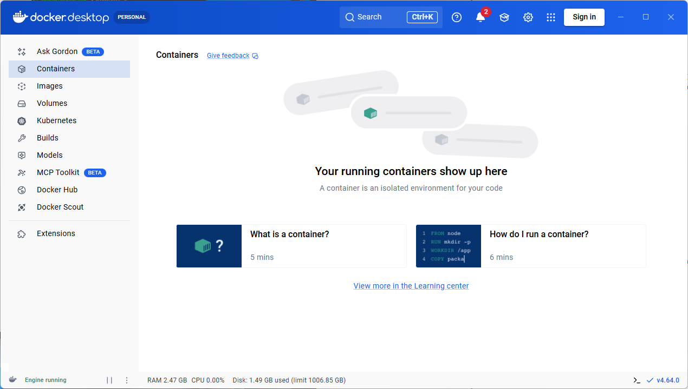
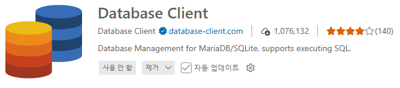
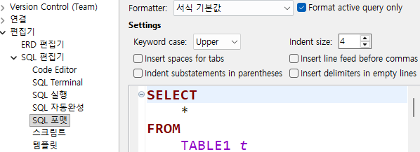

# iot-database-2026
2026년 IoT개발자 데이터베이스 지포지토리

## 1일차(03.13)

### 데이터/정보/지식

- **데이터**(Data) : 단순한 수치가 값
- **정보**(Information) :데이터에 의미를 부여한 것
- 지식(Knowlege) : 정보를 통한 사물이나 현상에 대한 이해

### 데이터베이스 DataBase

- 조직에 필요한 정보를 위해 논리적으로 연관된 데이터를 구조적으로 저장해 놓은 것
- **도메인** Domain - 자기 업무에 관련된 지식
- 기업/기관은 자기 도메인 정보만 저장
- 보통 **CS**(Client - Server) 프로그램이라고 명칭. DB쪽이 서버,  프로그램쪽이 클라이언트

#### 데이터베이스 개념

- 통합 데이터 - `데이터 중복 최소화`, 중복으로 인한 `데이터 불일치 현상 제거`
- 저장 데이터 - 문서가 아닌 `컴퓨터 저장장치`에 저장, 반영구적 저장
- 운영 데이터 - 저장된 상태에서 `업무를 위해 사용`. 검색, 수정 등
- 공용 데이터 - 여러 사람이 업무를 위해 `공동으로 사용`

#### 데이터베이스 특징

- 실시간 접근성 - 수 초내 결과가 리턴
- 계속적 변화 - 추가, 수정, 조회, 삭제가 가능
- 동시 공유 - 여러 사용자가 동시에 공유, 같은 데이터를 사용하더라도 최대한 문제가 없게 처리 
- 내용에 따른 참조 - 물리적인 저장 데이터가 아닌 데이터 값을 참조

#### DBMS
- 데이터베이스를 관리하는 시스템  DataBase Management System의 약자
- DBMS를 데이터베이스, DB로 통칭

#### DBMS의 장점

- `데이터 중복 최소화`, 데이터 일관성, 데이터 독립성, 관리 기능(백업, 복구, `동시성 제어`, 계정, 보안), 개발 생산성, `데이터 무결성 유지`, 데이터 표준 준수 . . .
- 데이터 중복 최소화, 무결성 유지가 제일 중요

### 데이터베이스 설치

#### 로컬 설치

1. https://www.mysql.com/ 사이트 다운로드 메뉴
2. MySQL Community Edition 아래 링크 클릭
3. MySQL Installer for Windows 클릭
4. MySQL Installer 8.9.45, windows (x86, 32-bit), MSI Installer 500M 이상 다운로드
5. 회원가입이나 로그인 없이 No thanks, just start my download. 클릭
6. mysqp-installer-community-8.0.45.0.msi 실행


#### 도커사용 설치

7. 일반적인 프로그램 설치와 동일

- Docker - 애플리케이션 신속 구축, 테스트, 서비스할 수 있는 컨테이너 기반의 오픈소스 가상화 플랫폼
    - 온라인 상에서 이미지를 다운로드(Pull)
    - 실행하는 컨테이너로 만듦(RUN)
    - 가상환경을 만들어주는 플랫폼

1. 도커 설치

    - https://www.docker.com/ 사이트 Download Docker Desktop 클릭
    - Docker Desktop Installer.exe 실행 

    

    

    - Close And Restart로 재부팅
    - Docker subsription Service Agreement 창 Accept 클릭
    - Linux용 Windows 하위 시스템 설치 필수, `wsl --update` 실행

    

2. 도커 설정
    - 설정 > Start Docker Desktop when you sign in to your computer 체크

3. 도커 콘솔 명령어
    ```Powershell
    > docker
    > docker --version
    > docker search 이미지명
    > docker pull 이미지명
    > docker run ...
    ```
4. MySQL 설치

    - Powershell   열기
    - docker search는 도커허브 검색기능

    ```Powershell
    > docker search mysql
    ```

    - docker pull 이미지 다운

    ```Powershell
    > docker pull mysql:8.0.45
    ```
    

    - doker run 컨테이너 실행

    ```Powershell
    # \는 윈도우에서 사용불가, 여러줄 명령 불가능
    > docker run -d --name mysql80 -p 3306:3306 -e MYSQL_ROOT_PASSWORD=my123456 -e MYSQL_DATABASE=mydb -e MYSQL_USER=myuser -e MYSQL_PASSWORD=my123456 -v mysql80_data:/var/lib/mysql --restart unless-stopped mysql:8.0.45
    ```
- 필요 계정
    - root - my123456
    - myuser - my123456

    - 옵션 설명
        - `--name mysql80` : 컨테이너 이름
        - `-p 3306:3306` : 포트번호, 컴퓨터에서 접근하는 포트 : 컨테이너 내부 포트
        - `MYSQL_ROOT_PASSWORD` : Mysql 관리자 root계정 비밀번호 초기화
        - `MYSQL_DATABASE` : 컨테이너 시작 시 자동 생성할 DB
        - `MYSQL_USER`/`MYSQL_PASSWORD` : 일반 사용자 계정
        - `-v mysql80_data:/var/lib/mysql` : 컨테이너 내 mysql 데이터 저장 위치
        - `--restart unless-stopped` : 도커 재시작시 자동 복구
    - 윈도우에서 도커는 \로 내려서 쓰는게 안된다

    - `docker ps` - 현재 실행중인 컨테이너 확인
    - docker exec - 도커 컨테이너 내부 접속

    ```Powershell
    > docker exec -it mysql80 mysql -u root -p
    Enter password :
    ```

5. MySQL Workbench 설치

    - Database 개발툴
    - 로컬에서 다운로드한 mysql-installer-community-8.0.45.0.msi
    - MySQL Connections 옆 ⊕ 클릭
        
        
    - sys - 관리자용 데이터베이스

6. DBeaver 개발툴 설치 (나중에)

    - https://dbeaver.io/
    - `Download EXE` 클릭
    - 일반적인 프로그램 설치와 동일


7. Visual Studio Code DB확장 설치

    - 확장 > Database 검색
    - Database Client 설치
    - Database 아이콘 클릭 > `Create Connection` 버튼 클릭
    

    

#### MySQL 접속

- 관리자계정 - root
    - 새 사용자 생성, 새 데이터베이스 생성, 권한, 백업 및 복구
- 일반계정 - myuser, madang
    - 해당 데이터베이스에서 데이터 처리 작업

### 기본 이론

#### 관계형 데이터베이스

- Relational Database
    - 1969년 E.F.Codd 수학 모델에 근간해서 고안
    - 테이블을 최소단위로 구성
    - 각 테이블간 관계를 통해서 데이터모델 구성

#### 데이터베이스 종류
- 관계형 데이터베이스
    - Oracle(가장 비쌈), SQL Server(MS), MySQL(Oracle), MariaDB, PostgreSQL(오픈소스)
- NoSQL 데이터베이스
    - MongoDB, Redis, Apache Cassandra, ...
- In-memory 데이터베이스
    - SAP HANA...

#### SQL
- Structured Query Language
    - 구조화된 질의 언어
    - 데이터베이스에서 데이터를 조작하고, 테이블과 같은 객체를 컨트롤하는 등의 작업을 수행하는 프로그래밍 언어

- SQL 종류
    - DML(Data Manipulation Language) - 데이터 조작어.
    > `SELECT`, `INSERT`, `UPDATE`, `DELETE`와 같은 데이터를 조작하는 언어
    - DDL(Data Definition Language) - 데이터 정의어.
    > `CREATE`, `ALTER`, `RENAME`, `DROP` 같은 객체(데이터베이스, 테이블, 사용자, 뷰, 인덱스,...)를 처리하는 언어
    - DCL(Data Control Language) - 데이터 제어어.
    > `GRANT`, `REVOKE` 와 같아 사용자에게 권한을 주고 해제하는 기능을 처리하는 언어
    -TCL(Transaction Control Language) - 트랜잭션 제어어
    > `BEGIN TRAN`, `COMMIT`, `ROLLBACK` 같은 트랜잭션 처리로 동시성 제어를 위한 언어

### SELECT 실습

- DBeaver 설정
    - 환경설정 > 편집기 > SQL 편집기 > SQL 포맷
    - Keyword case > Upper로 변경

    

- 기본문법

    ```sql
    -- 기본 조회 쿼리, * -> `올`이라고 호칭. ALL 키워드와 다름
    -- ALL 키워드는 잘 사용하지 않음
    SELECT * 
      FROM 테이블명;

    -- 컬럼(열) 명시할 때, 열 순서를 바꿔서 조회할 때
    SELECT 열1, 열2, ... 열n
      FROM 테이블명;

    -- 조건 필터링(필요한 행, 레코드)만 조회할 때
    SELECT *|열이름 나열
      FROM 테이블명
     WHERE 조건...;

    -- 정렬하고 싶을때
    -- ASCending(오름차순) | DESCending(내림차순)
    -- ASC는 기본이므로 생략 가능
    SELECT *|열이름 나열
      FROM 테이블명
     WHERE 조건...;
     ORDER BY 열1, 열2 ASC|DESC;

    ```